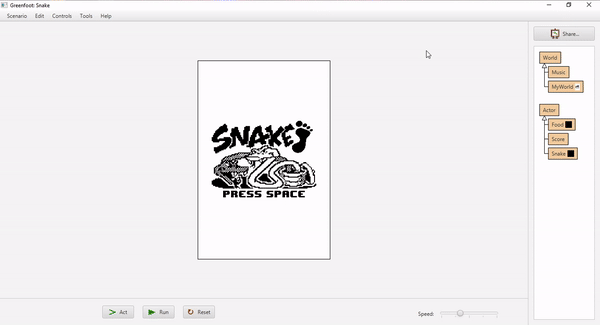

<p align="center">
  
</p>

<h1 align="center">Snake-Greenfoot</h1>
<p align="center">Projects developed in the 3rd year of high school programming class using Greenfoot.</p>

<h3 align="center">

 <!-- Status -->
 

 <!-- License -->
  <a href="./LICENSE" target="_blank">
    
  </a>

 <!-- Forks -->
 

 <!-- Stars -->
 

</h3>

<br />

## 🧪 Technologies

-  | [Java](https://docs.oracle.com/en/java/)
-  | [Greenfoot](https://www.greenfoot.org/)

<h3 align="center">
  
</h3>

## 🚀 Getting started

Clone the project and access the folder.

```bash
$ git clone https://github.com/dbreskovit/Snake-Greenfoot
```

Use the <a href="https://www.greenfoot.org/">Greenfoot</a> to run the game.

## 🦄 Authors

<table>
  <tr>
    <td align="center">
      <a href="https://github.com/dbreskovit" style="text-decoration: none;color: #9644CD;">
              
            <br>
        <sub>
          <b>Diego</b>
        </sub>
      </a>
    </td>
  </tr>
</table>

#

<p align="center">
    <sub>Copyright © 2022 - dbreskovit</sub><br>
    <sub>Made with 💜 by <a href="https://github.com/dbreskovit" style="text-decoration: none;color: #9644CD;">dbreskovit</sub></a>
</p>
